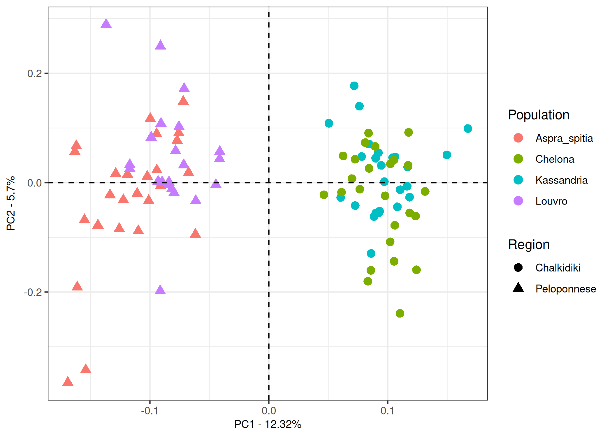

``` r
knitr::opts_chunk$set(echo = TRUE, include=TRUE, cache=FALSE,
                      dev = c("png", "pdf", "svg"), dpi = 300)
```

# Load libraries

``` r
library(tidyverse)
```

```
## ── Attaching core tidyverse packages ──────────────────────── tidyverse 2.0.0 ──
## ✔ dplyr     1.1.4     ✔ readr     2.1.5
## ✔ forcats   1.0.0     ✔ stringr   1.5.1
## ✔ ggplot2   3.5.1     ✔ tibble    3.2.1
## ✔ lubridate 1.9.4     ✔ tidyr     1.3.1
## ✔ purrr     1.0.4     
## ── Conflicts ────────────────────────────────────────── tidyverse_conflicts() ──
## ✖ dplyr::filter() masks stats::filter()
## ✖ dplyr::lag()    masks stats::lag()
## ℹ Use the conflicted package (<http://conflicted.r-lib.org/>) to force all conflicts to become errors
```

# Read and manipulate data
Read data

``` r
# read in data
pca <- read_table2("../results/Phalepensis_pruned.eigenvec", col_names = FALSE)
```

```
## Warning: `read_table2()` was deprecated in readr 2.0.0.
## ℹ Please use `read_table()` instead.
## This warning is displayed once every 8 hours.
## Call `lifecycle::last_lifecycle_warnings()` to see where this warning was
## generated.
```

```
## 
## ── Column specification ────────────────────────────────────────────────────────
## cols(
##   .default = col_double(),
##   X1 = col_character(),
##   X2 = col_character()
## )
## ℹ Use `spec()` for the full column specifications.
```

``` r
eigenval <- scan("../results/Phalepensis_pruned.eigenval")
```

Data wrangling

``` r
# sort out the pca data
# remove nuisance column
pca <- pca[,-1]
# set names
names(pca)[1] <- "ind"
names(pca)[2:ncol(pca)] <- paste0("PC", 1:(ncol(pca)-1))
```

Add strata information (Genotype, Population, Region)

``` r
# load strata information
strata <- read.csv("../data/strata.csv", stringsAsFactors = TRUE)

pca$ind <- strata$Genotype

pca <- as_tibble(data.frame(pca, strata[,c(2:4)]))
```

Calculate the percentage variance explained

``` r
# first convert to percentage variance explained
pve <- data.frame(PC = 1:20, pve = eigenval/sum(eigenval)*100)

# calculate the cumulative sum of the percentage variance explained
cumsum(pve$pve)
```

```
##  [1]  12.32339  18.01868  23.32375  28.48430  33.59843  38.60579  43.51463
##  [8]  48.35442  53.04027  57.65795  62.17926  66.62100  71.00457  75.33953
## [15]  79.66036  83.82652  87.93990  92.02943  96.01723 100.00000
```

# Plots
Screeplot

``` r
variance_pca_plot <- ggplot(pve, aes(x=PC, y=pve))+
  geom_line(group=1)+
  geom_point(size=2)+
  theme_bw() +
  scale_x_continuous(breaks = seq(1, 20, 3)) +
  xlab("Axis") +
  ylab("Explained variance (%)")

variance_pca_plot
```

<!-- -->

PCA plot

``` r
pca_p <- ggplot(data=pca, aes(x=PC1, y=PC2, label=ind)) +
  geom_point(aes(color=Population, shape=Region), size=3) +
  theme_bw() +
  xlab(paste("PC1 - ", round(pve$pve[1], 2), "%", sep="")) +
  ylab(paste("PC2 - ", round(pve$pve[2], 2), "%", sep="")) +
  geom_hline(yintercept = 0, linetype = "dashed") +
  geom_vline(xintercept = 0, linetype = "dashed") +
  theme(axis.title = element_text(size = 9))
  
pca_p
```

<!-- -->

PCA plot PC3 and PC4

``` r
pca34_p <- ggplot(data=pca, aes(x=PC3, y=PC4, label=ind)) +
  geom_point(aes(color=Population, shape=Region), size=3) +
  theme_bw() +
  xlab(paste("PC3 - ", round(pve$pve[3], 2), "%", sep="")) +
  ylab(paste("PC4 - ", round(pve$pve[4], 2), "%", sep="")) +
  geom_hline(yintercept = 0, linetype = "dashed") +
  geom_vline(xintercept = 0, linetype = "dashed") +
  theme(axis.title = element_text(size = 9))
  
pca34_p
```

<!-- -->
