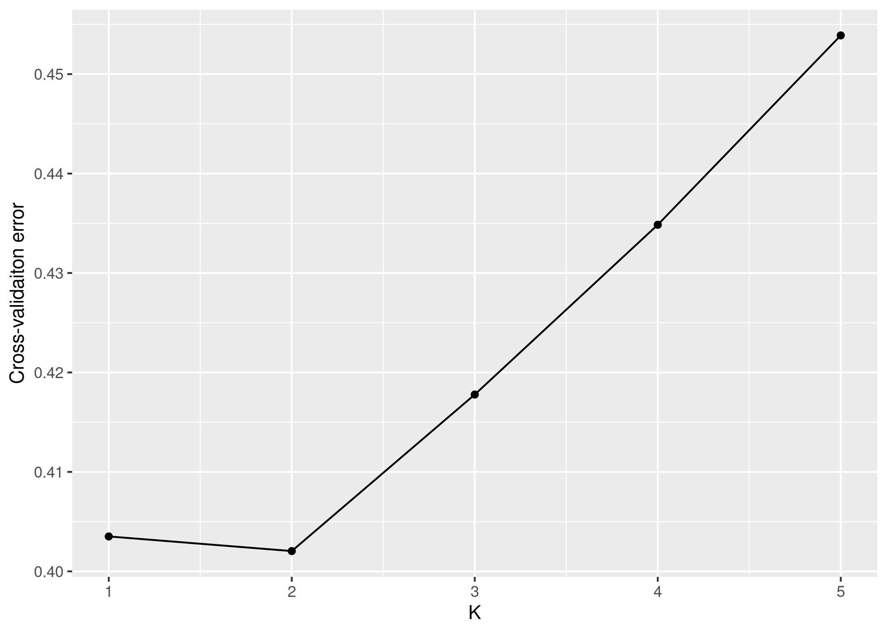

``` r
knitr::opts_chunk$set(echo = TRUE, include=TRUE, cache=FALSE,
                      dev = c("png", "pdf", "svg"), dpi = 300)
```

# Load libraries

``` r
library(ggplot2)
```

# CV plot
load the data

``` r
cv <- read.table("../results/admixture/cv.error", header = FALSE)
colnames(cv) <- c("K", "CV")
```

plot cv

``` r
ggplot(cv, aes(x=K, y=CV)) +
  geom_point()+
  geom_line() +
  ylab("Cross-validaiton error")
```

<!-- -->

