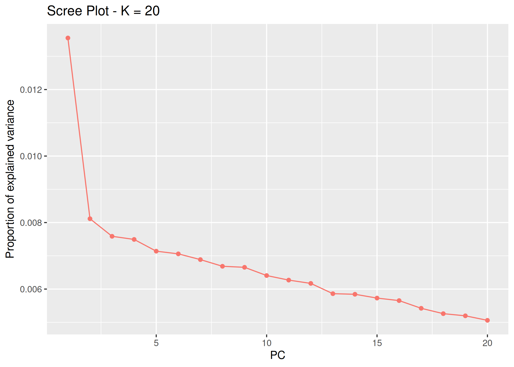
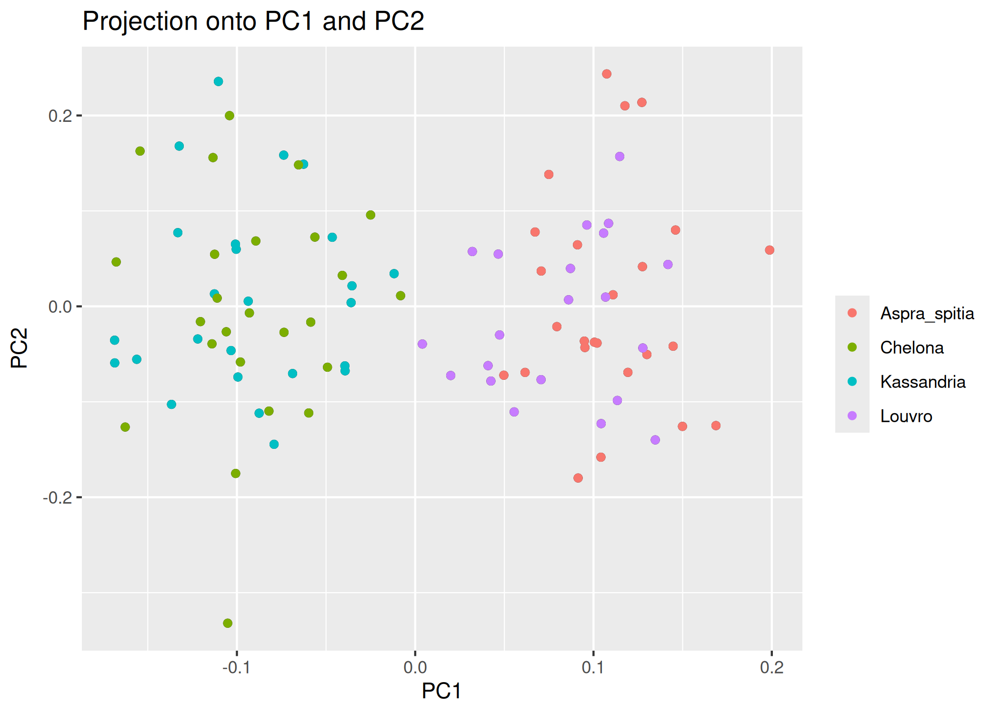
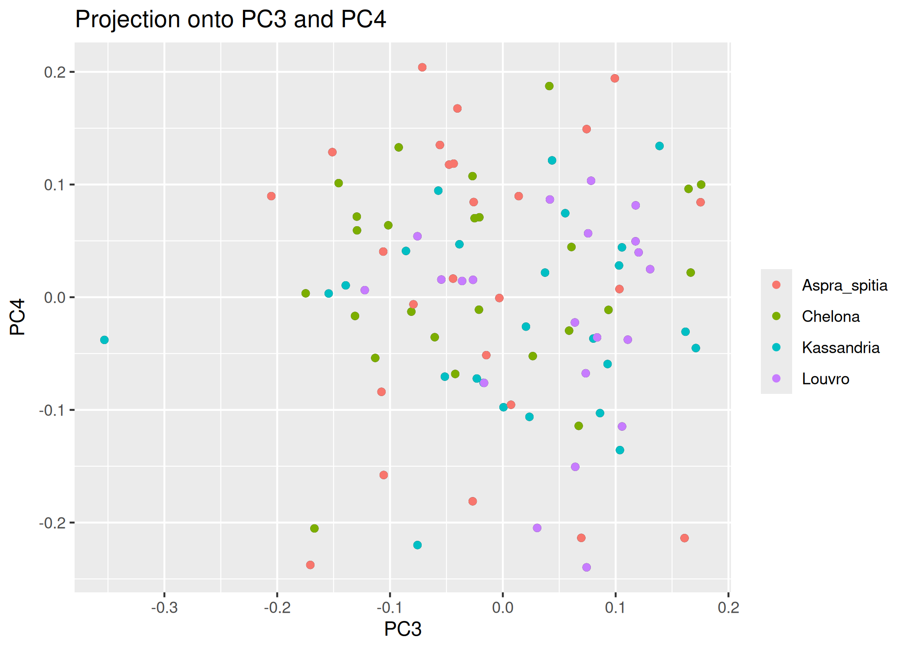
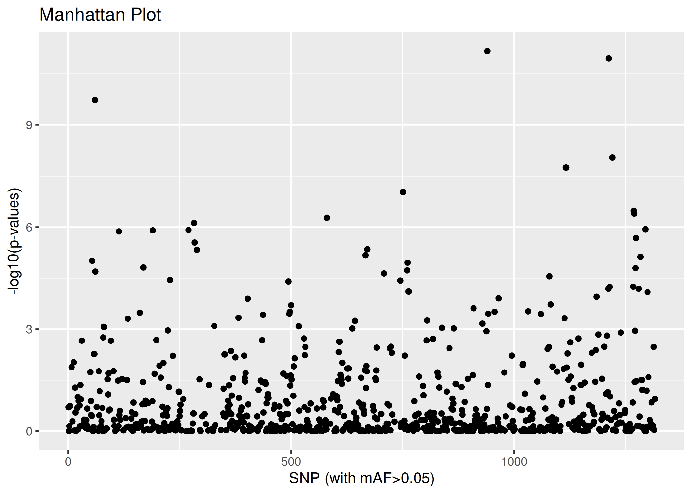
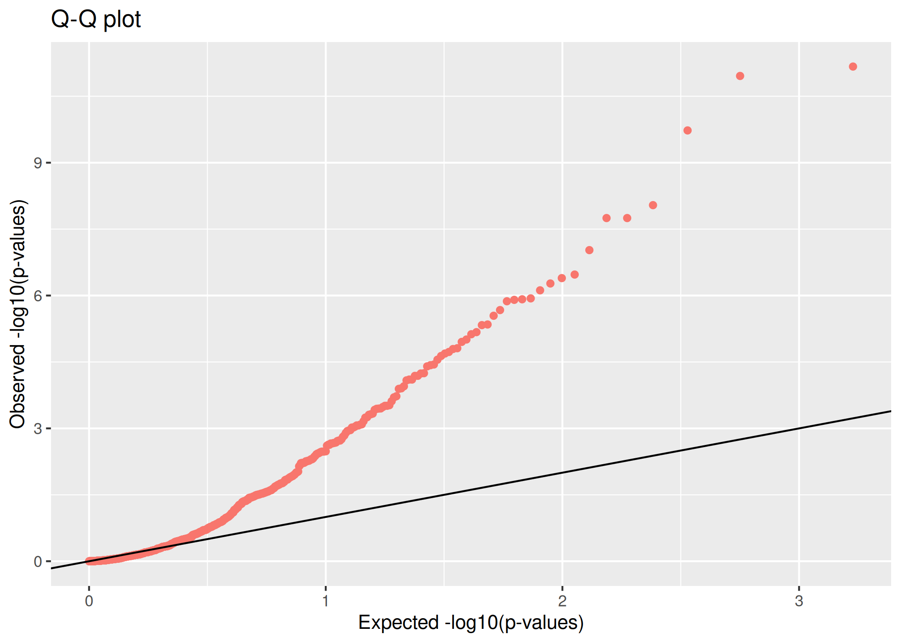
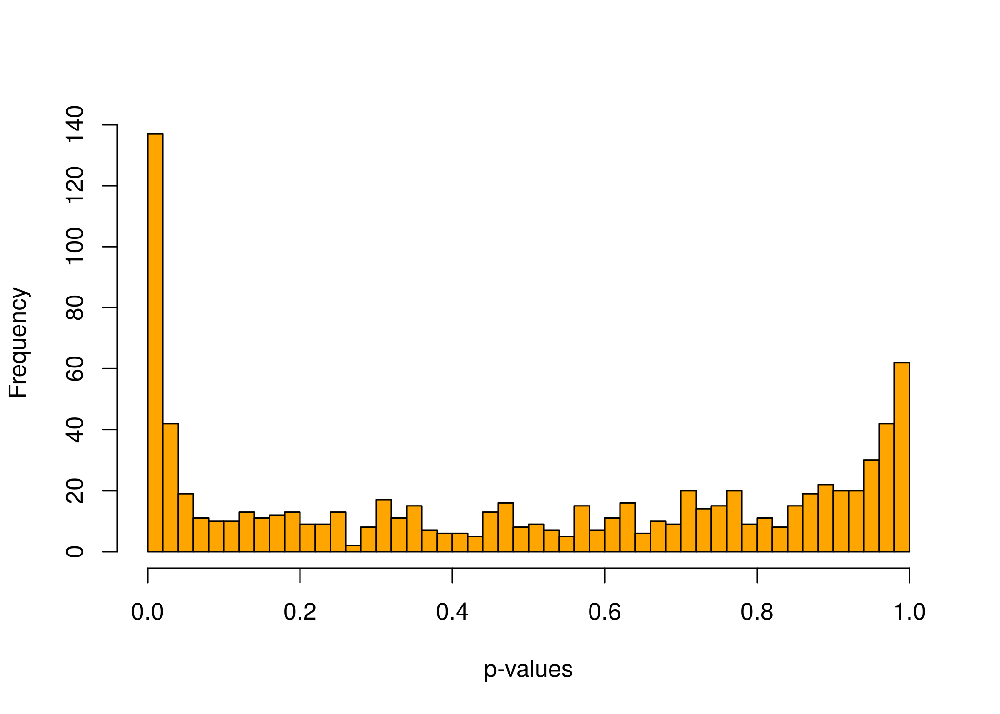
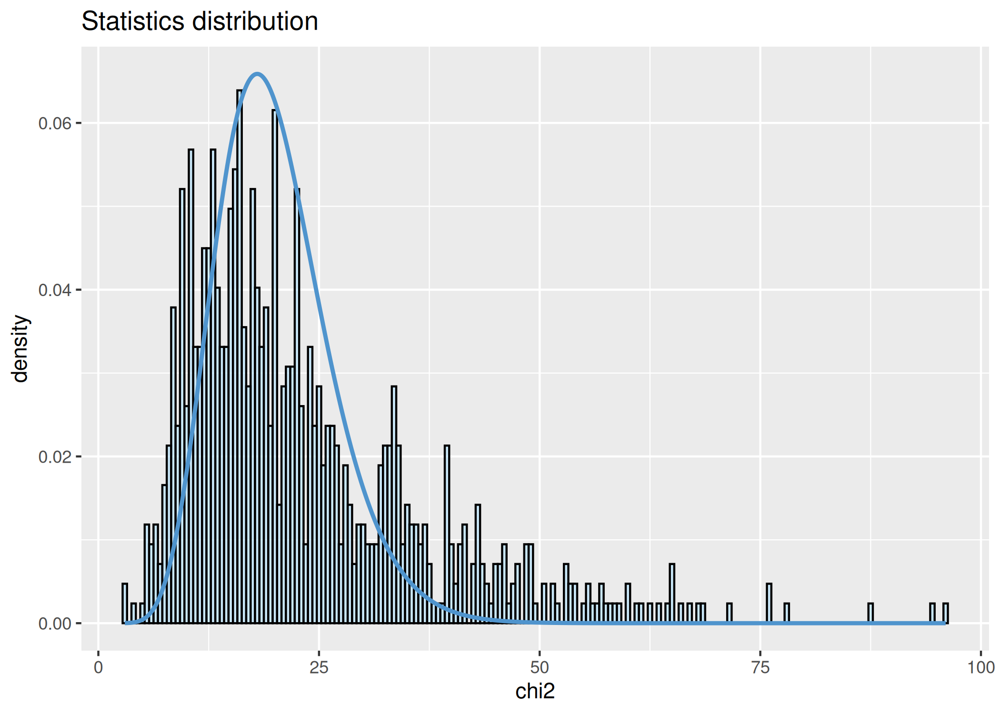

``` r
knitr::opts_chunk$set(echo = TRUE, include=TRUE, cache=FALSE,
                      dev = c("png", "pdf", "svg"), dpi = 300)
```

# Setup

``` bash
mkdir -p ../results/pcadapt
```


``` r
library(pcadapt)
library(ggplot2)
library(dplyr)
```

```
## 
## Attaching package: 'dplyr'
```

```
## The following objects are masked from 'package:stats':
## 
##     filter, lag
```

```
## The following objects are masked from 'package:base':
## 
##     intersect, setdiff, setequal, union
```

``` r
# library(qvalue) # Needed for FDR multiple test correction
```

### pcadapt

``` r
filename <- read.pcadapt(
              "../results/pcadapt/Phalepensis_filtSNPs_TARGET_GR_pops.bed",
              type = "bed")
```


``` r
obj_mat <- bed2matrix(bedfile = "../results/pcadapt/Phalepensis_filtSNPs_TARGET_GR_pops.bed")
dim(obj_mat)
```

```
## [1]   96 1316
```


``` r
x <- pcadapt(input = filename, 
             K = 20, 
             min.maf = 0.05,
             ploidy = 2,
             LD.clumping = list(size = 500, thr = 0.1)
             )

par(mfrow = c(2, 2))
for (i in 1:4)
  plot(x$loadings[, i], pch = 19, cex = .3, ylab = paste0("Loadings PC", i))
```

<!-- -->


``` r
p1 <- plot(x, option = "screeplot")
```

```
## Warning: The `<scale>` argument of `guides()` cannot be `FALSE`. Use "none" instead as
## of ggplot2 3.3.4.
## ℹ The deprecated feature was likely used in the pcadapt package.
##   Please report the issue at <https://github.com/bcm-uga/pcadapt/issues>.
## This warning is displayed once every 8 hours.
## Call `lifecycle::last_lifecycle_warnings()` to see where this warning was
## generated.
```

<!-- -->


``` r
# load strata information
strata <- read.csv("../data/strata.csv", stringsAsFactors = TRUE)

poplist.names <- strata[,2]
```


``` r
p2 <- plot(x, option = "scores", pop = poplist.names)
```

```
## Warning: Use of `df$Pop` is discouraged.
## ℹ Use `Pop` instead.
```

<!-- -->

``` r
p3 <- plot(x, option = "scores", i = 3, j = 4, pop = poplist.names)
```

```
## Warning: Use of `df$Pop` is discouraged.
## ℹ Use `Pop` instead.
```

<!-- -->


``` r
# x <- pcadapt(filename, K = 2, min.maf = 0.05
             # ,LD.clumping = list(size = 50000, thr = 0.1)
# )
summary(x)
```

```
##                 Length Class  Mode   
## scores           1920  -none- numeric
## singular.values    20  -none- numeric
## loadings        26320  -none- numeric
## zscores         26320  -none- numeric
## af               1316  -none- numeric
## maf              1316  -none- numeric
## chi2.stat        1316  -none- numeric
## stat             1316  -none- numeric
## gif                 1  -none- numeric
## pvalues          1316  -none- numeric
## pass              845  -none- numeric
```


``` r
plot(x , option = "manhattan")
```

<!-- -->


``` r
p4 <- plot(x, option = "qqplot")
p4
```

<!-- -->


``` r
hist(x$pvalues, xlab = "p-values", main = NULL, breaks = 50, 
           col = "orange")
```

<!-- -->


``` r
p6 <- plot(x, option = "stat.distribution")
p6
```

```
## Warning: The dot-dot notation (`..density..`) was deprecated in ggplot2 3.4.0.
## ℹ Please use `after_stat(density)` instead.
## ℹ The deprecated feature was likely used in the pcadapt package.
##   Please report the issue at <https://github.com/bcm-uga/pcadapt/issues>.
## This warning is displayed once every 8 hours.
## Call `lifecycle::last_lifecycle_warnings()` to see where this warning was
## generated.
```

```
## Warning: Removed 10 rows containing non-finite outside the scale range
## (`stat_bin()`).
```

<!-- -->

Multiple test correction

``` r
# Bonferroni approach
padj <- p.adjust(x$pvalues,method="bonferroni")
alpha <- 0.01
outliers <- which(padj < alpha)
length(outliers)
```

```
## [1] 23
```

``` r
# FDR approach
# qval <- qvalue(x$pvalues)$qvalues
# alpha <- 0.01
# outliers <- which(qval < alpha)
# length(outliers)
```


``` r
bim <- read.table("../results/pcadapt/Phalepensis_filtSNPs_TARGET_GR_pops.bim",
                  header = FALSE)
str(bim)
```

```
## 'data.frame':	1316 obs. of  6 variables:
##  $ V1: chr  "clc_contig_10022" "clc_contig_10022" "clc_contig_10022" "clc_contig_10138" ...
##  $ V2: chr  "clc_contig_10022_116" "clc_contig_10022_632" "clc_contig_10022_1060" "clc_contig_10138_519" ...
##  $ V3: int  0 0 0 0 0 0 0 0 0 0 ...
##  $ V4: int  116 632 1060 519 520 615 939 990 2203 3521 ...
##  $ V5: chr  "T" "A" "T" "A" ...
##  $ V6: chr  "C" "C" "C" "G" ...
```

``` r
dim(bim)
```

```
## [1] 1316    6
```

# Write an output file

``` r
pca_df <- data.frame(chr = bim$V1, 
                     position = bim$V4, 
                     pvalue = x$pvalues, 
                     p.adj = padj)

pca_df <- pca_df %>% 
  filter(!is.na(pvalue)) %>% 
  arrange(pvalue)


pca_df
```

```
##                   chr position       pvalue        p.adj
## 1          Contig2025     4292 6.748092e-12 5.702137e-09
## 2          Contig5600      420 1.099559e-11 9.291277e-09
## 3     clc_contig_1097     4766 1.867707e-10 1.578212e-07
## 4          Contig5700      429 9.094778e-09 7.685087e-06
## 5          Contig3594      917 1.779338e-08 1.503541e-05
## 6          Contig3594      922 1.779338e-08 1.503541e-05
## 7     clc_contig_9705     1345 9.427891e-08 7.966568e-05
## 8           Contig702      254 3.357523e-07 2.837107e-04
## 9           Contig702      255 4.039217e-07 3.413138e-04
## 10    clc_contig_6236     2722 5.343811e-07 4.515521e-04
## 11    clc_contig_2369      979 7.620757e-07 6.439539e-04
## 12         Contig7657     3888 1.159485e-06 9.797646e-04
## 13    clc_contig_2246     3263 1.215638e-06 1.027214e-03
## 14   clc_contig_16936     1769 1.252117e-06 1.058039e-03
## 15   clc_contig_12687     4091 1.345820e-06 1.137218e-03
## 16          Contig702     3264 2.128707e-06 1.798757e-03
## 17    clc_contig_2369     2389 2.860456e-06 2.417085e-03
## 18    clc_contig_7155     1115 4.507382e-06 3.808738e-03
## 19    clc_contig_2387      639 4.655888e-06 3.934225e-03
## 20     clc_contig_713     3059 6.704061e-06 5.664931e-03
## 21         Contig7137      981 7.480647e-06 6.321147e-03
## 22    clc_contig_1097     1186 9.840755e-06 8.315438e-03
## 23    clc_contig_9969     2634 1.114067e-05 9.413862e-03
## 24   clc_contig_16011     3481 1.547292e-05 1.307462e-02
## 25          Contig702     3256 1.613316e-05 1.363252e-02
## 26    clc_contig_9969     2298 1.881069e-05 1.589503e-02
## 27    clc_contig_1097     4788 2.039633e-05 1.723490e-02
## 28    clc_contig_8124     1950 2.316854e-05 1.957742e-02
## 29         Contig3055     2606 2.809910e-05 2.374374e-02
## 30    clc_contig_1886     1560 3.605982e-05 3.047055e-02
## 31    clc_contig_9337      573 3.740927e-05 3.161083e-02
## 32    clc_contig_5172      627 3.973145e-05 3.357308e-02
## 33         Contig7016     1424 5.674471e-05 4.794928e-02
## 34         Contig5609      487 5.757293e-05 4.864913e-02
## 35         Contig7061     7869 6.498752e-05 5.491446e-02
## 36         Contig5600      411 6.518078e-05 5.507776e-02
## 37    clc_contig_9969     2979 7.892302e-05 6.668995e-02
## 38    clc_contig_9969     2986 7.892302e-05 6.668995e-02
## 39          Contig874     1406 8.230185e-05 6.954507e-02
## 40         Contig4723     1663 1.119943e-04 9.463518e-02
## 41         Contig2281     1232 1.246119e-04 1.052970e-01
## 42    clc_contig_3581     3551 1.280975e-04 1.082424e-01
## 43         Contig3059     3709 1.880775e-04 1.589254e-01
## 44    clc_contig_5173      843 1.989928e-04 1.681489e-01
## 45         Contig1825      238 2.435148e-04 2.057700e-01
## 46         Contig2546      185 2.996576e-04 2.532107e-01
## 47    clc_contig_5172     2672 3.086643e-04 2.608213e-01
## 48         Contig2166     3325 3.092320e-04 2.613010e-01
## 49   clc_contig_15135      697 3.292358e-04 2.782042e-01
## 50         Contig2025     4330 3.547921e-04 2.997993e-01
## 51    clc_contig_5172     2662 3.571701e-04 3.018087e-01
## 52         Contig2814      583 3.613432e-04 3.053350e-01
## 53    clc_contig_4065     1097 3.807927e-04 3.217699e-01
## 54     clc_contig_321     2539 4.639021e-04 3.919973e-01
## 55         Contig3515     1280 4.791508e-04 4.048824e-01
## 56   clc_contig_13178     1078 4.927285e-04 4.163556e-01
## 57         Contig1178      109 5.594881e-04 4.727675e-01
## 58    clc_contig_6885      489 5.709591e-04 4.824605e-01
## 59         Contig1954     1181 6.894159e-04 5.825564e-01
## 60   clc_contig_25987      324 8.090927e-04 6.836833e-01
## 61    clc_contig_5198     7135 8.250669e-04 6.971815e-01
## 62   clc_contig_11322      830 8.575902e-04 7.246637e-01
## 63   clc_contig_11322      853 8.575902e-04 7.246637e-01
## 64         Contig1346     3370 9.110900e-04 7.698711e-01
## 65         Contig1515     7945 9.527486e-04 8.050726e-01
## 66    clc_contig_6779     4283 9.567992e-04 8.084953e-01
## 67    clc_contig_1760     2379 1.093247e-03 9.237940e-01
## 68          Contig702     2344 1.114600e-03 9.418372e-01
## 69         Contig2025     2898 1.150356e-03 9.720507e-01
## 70         Contig6270     1738 1.263389e-03 1.000000e+00
## 71         Contig4838      153 1.443511e-03 1.000000e+00
## 72         Contig5471     1408 1.552994e-03 1.000000e+00
## 73   clc_contig_11302     4084 1.759454e-03 1.000000e+00
## 74    clc_contig_5400     2448 1.883955e-03 1.000000e+00
## 75         Contig3922     2473 1.885385e-03 1.000000e+00
## 76         Contig1318     1395 1.931834e-03 1.000000e+00
## 77   clc_contig_17008     2747 2.081134e-03 1.000000e+00
## 78    clc_contig_3995     2741 2.117471e-03 1.000000e+00
## 79         Contig1178       85 2.146861e-03 1.000000e+00
## 80   clc_contig_10701     1365 2.187438e-03 1.000000e+00
## 81   clc_contig_12359      821 2.197652e-03 1.000000e+00
## 82     clc_contig_657     1018 2.345801e-03 1.000000e+00
## 83     clc_contig_657     1021 2.345801e-03 1.000000e+00
## 84         Contig3647       87 2.455179e-03 1.000000e+00
## 85    clc_contig_9142      356 3.295066e-03 1.000000e+00
## 86         Contig5177     2214 3.302279e-03 1.000000e+00
## 87  Phal_PtaS26638183      746 3.344661e-03 1.000000e+00
## 88     clc_contig_540     1296 3.346304e-03 1.000000e+00
## 89         Contig3022      158 3.392391e-03 1.000000e+00
## 90    clc_contig_7728      599 3.502196e-03 1.000000e+00
## 91         Contig1497     2987 3.645552e-03 1.000000e+00
## 92    clc_contig_8963     2086 3.705935e-03 1.000000e+00
## 93         Contig2973      191 3.839648e-03 1.000000e+00
## 94         Contig4605     2033 4.148046e-03 1.000000e+00
## 95    clc_contig_3075     2334 4.383748e-03 1.000000e+00
## 96     clc_contig_657      663 4.748342e-03 1.000000e+00
## 97     clc_contig_915     3683 4.971068e-03 1.000000e+00
## 98         Contig4557      211 4.972732e-03 1.000000e+00
## 99         Contig3620      389 5.208395e-03 1.000000e+00
## 100   clc_contig_1097     3780 5.385554e-03 1.000000e+00
## 101   clc_contig_1097     3781 5.385554e-03 1.000000e+00
## 102    clc_contig_295     6975 5.531664e-03 1.000000e+00
## 103    clc_contig_295     6987 5.531664e-03 1.000000e+00
## 104    clc_contig_540      297 5.841532e-03 1.000000e+00
## 105        Contig2408      645 6.016275e-03 1.000000e+00
## 106   clc_contig_9943     3156 6.025001e-03 1.000000e+00
## 107    clc_contig_341     2073 6.026939e-03 1.000000e+00
## 108   clc_contig_2031      888 6.084852e-03 1.000000e+00
## 109   clc_contig_3195      246 6.758266e-03 1.000000e+00
## 110   clc_contig_5186      514 7.196152e-03 1.000000e+00
## 111  clc_contig_10191      158 9.420198e-03 1.000000e+00
## 112    clc_contig_657     3948 9.747403e-03 1.000000e+00
## 113  clc_contig_17125     1530 9.858337e-03 1.000000e+00
## 114        Contig2482     1292 1.046014e-02 1.000000e+00
## 115        Contig4049     1162 1.107965e-02 1.000000e+00
## 116        Contig2482      522 1.134329e-02 1.000000e+00
## 117  clc_contig_17069     1882 1.190755e-02 1.000000e+00
## 118    clc_contig_713     6252 1.209089e-02 1.000000e+00
## 119   clc_contig_5173     4316 1.243348e-02 1.000000e+00
## 120        Contig3083       86 1.266909e-02 1.000000e+00
## 121  clc_contig_10138      990 1.313807e-02 1.000000e+00
## 122        Contig3616      497 1.350126e-02 1.000000e+00
## 123   clc_contig_6729      498 1.426508e-02 1.000000e+00
## 124   clc_contig_6729      441 1.442063e-02 1.000000e+00
## 125   clc_contig_6729      449 1.442063e-02 1.000000e+00
## 126        Contig3515      939 1.472845e-02 1.000000e+00
## 127    clc_contig_713      802 1.608620e-02 1.000000e+00
## 128   clc_contig_7728      509 1.642555e-02 1.000000e+00
## 129  clc_contig_12360     7460 1.716656e-02 1.000000e+00
## 130  clc_contig_11143     4954 1.738105e-02 1.000000e+00
## 131    clc_contig_713     6268 1.743764e-02 1.000000e+00
## 132        Contig3187      737 1.767306e-02 1.000000e+00
## 133  clc_contig_10951      977 1.843249e-02 1.000000e+00
## 134        Contig1318     7929 1.882818e-02 1.000000e+00
## 135        Contig2350      695 1.884925e-02 1.000000e+00
## 136   clc_contig_3481     4252 1.957311e-02 1.000000e+00
## 137  clc_contig_12027    10360 1.984115e-02 1.000000e+00
## 138   clc_contig_4802     1579 2.036867e-02 1.000000e+00
## 139   clc_contig_1699     2744 2.072156e-02 1.000000e+00
## 140    clc_contig_657     2494 2.215442e-02 1.000000e+00
## 141        Contig1800     1975 2.264297e-02 1.000000e+00
## 142   clc_contig_5173      304 2.313354e-02 1.000000e+00
## 143   clc_contig_4897     1319 2.387964e-02 1.000000e+00
## 144        Contig1120     1196 2.488094e-02 1.000000e+00
## 145         Contig365      663 2.496295e-02 1.000000e+00
## 146        Contig1318    10334 2.522592e-02 1.000000e+00
## 147         Contig874     1914 2.586928e-02 1.000000e+00
## 148    clc_contig_657     2497 2.636222e-02 1.000000e+00
## 149  clc_contig_17069     2933 2.671987e-02 1.000000e+00
## 150   clc_contig_6983     3209 2.694885e-02 1.000000e+00
## 151   clc_contig_3481      920 2.713518e-02 1.000000e+00
## 152   clc_contig_7728      449 2.784563e-02 1.000000e+00
## 153    clc_contig_312     1027 2.793800e-02 1.000000e+00
## 154   clc_contig_6729      492 2.856021e-02 1.000000e+00
## 155        Contig5063      907 2.885313e-02 1.000000e+00
## 156        Contig1682     2795 2.899503e-02 1.000000e+00
## 157   clc_contig_1281     5100 2.967025e-02 1.000000e+00
## 158     clc_contig_11     3503 2.973201e-02 1.000000e+00
## 159  clc_contig_24102      143 2.989701e-02 1.000000e+00
## 160   clc_contig_5173     1133 3.030057e-02 1.000000e+00
## 161    clc_contig_657     3304 3.061979e-02 1.000000e+00
## 162        Contig3620     2510 3.115764e-02 1.000000e+00
## 163        Contig7210      240 3.131185e-02 1.000000e+00
## 164        Contig7210      273 3.131185e-02 1.000000e+00
## 165  clc_contig_13170      628 3.177455e-02 1.000000e+00
## 166   clc_contig_7728      457 3.180477e-02 1.000000e+00
## 167   clc_contig_3970     2969 3.264999e-02 1.000000e+00
## 168  clc_contig_12687     2729 3.269466e-02 1.000000e+00
## 169        Contig7061     2431 3.363031e-02 1.000000e+00
## 170    clc_contig_657      589 3.406930e-02 1.000000e+00
## 171        Contig2741      491 3.478186e-02 1.000000e+00
## 172   clc_contig_3481     4173 3.478953e-02 1.000000e+00
## 173        Contig4564     7148 3.535737e-02 1.000000e+00
## 174         Contig702     1288 3.595397e-02 1.000000e+00
## 175  clc_contig_16011     2352 3.627552e-02 1.000000e+00
## 176   clc_contig_3995     3185 3.653963e-02 1.000000e+00
## 177    clc_contig_420     6102 3.688149e-02 1.000000e+00
## 178    clc_contig_420     6115 3.688149e-02 1.000000e+00
## 179        Contig4417      814 3.742195e-02 1.000000e+00
## 180    clc_contig_657     3316 4.033937e-02 1.000000e+00
## 181        Contig1536     2658 4.055556e-02 1.000000e+00
## 182   clc_contig_4230     1540 4.063976e-02 1.000000e+00
## 183        Contig1536     2676 4.149563e-02 1.000000e+00
## 184        Contig4049     1222 4.343612e-02 1.000000e+00
## 185         Contig395     2307 4.348588e-02 1.000000e+00
## 186        Contig2025     4314 4.383847e-02 1.000000e+00
## 187   clc_contig_1061     5079 4.388911e-02 1.000000e+00
## 188   clc_contig_2589     1579 4.434200e-02 1.000000e+00
## 189   clc_contig_3025     1572 4.484595e-02 1.000000e+00
## 190   clc_contig_5172     3654 4.563168e-02 1.000000e+00
## 191        Contig1128     2098 4.638224e-02 1.000000e+00
## 192        Contig1653      413 5.015553e-02 1.000000e+00
## 193  clc_contig_18846     1192 5.080034e-02 1.000000e+00
## 194        Contig1319     5681 5.182777e-02 1.000000e+00
## 195  clc_contig_10286     2025 5.231086e-02 1.000000e+00
## 196        Contig3809      474 5.370869e-02 1.000000e+00
## 197    clc_contig_713     3075 5.382064e-02 1.000000e+00
## 198    clc_contig_295     2446 5.625587e-02 1.000000e+00
## 199        Contig7311     3574 6.111655e-02 1.000000e+00
## 200        Contig7311     3575 6.111655e-02 1.000000e+00
## 201   clc_contig_3970     1422 6.124640e-02 1.000000e+00
## 202          Contig84      223 6.431582e-02 1.000000e+00
## 203  clc_contig_11302      926 6.638976e-02 1.000000e+00
## 204        Contig1454      889 6.846092e-02 1.000000e+00
## 205   clc_contig_2079     1881 6.887836e-02 1.000000e+00
## 206   clc_contig_2079     1882 6.887836e-02 1.000000e+00
## 207        Contig5600      196 7.130411e-02 1.000000e+00
## 208        Contig2519     2610 7.858979e-02 1.000000e+00
## 209        Contig5287     4608 7.930694e-02 1.000000e+00
## 210   clc_contig_6501     1484 8.121589e-02 1.000000e+00
## 211   clc_contig_4350     4809 8.160154e-02 1.000000e+00
## 212  clc_contig_12027     5861 8.282282e-02 1.000000e+00
## 213        Contig1128     2140 8.782661e-02 1.000000e+00
## 214   clc_contig_3075     3251 8.994361e-02 1.000000e+00
## 215   clc_contig_5173     4259 9.069822e-02 1.000000e+00
## 216    clc_contig_657      487 9.465792e-02 1.000000e+00
## 217        Contig5609      992 9.568816e-02 1.000000e+00
## 218  clc_contig_10344     1607 9.879516e-02 1.000000e+00
## 219   clc_contig_6501     1488 9.922801e-02 1.000000e+00
## 220   clc_contig_4350     4793 1.012259e-01 1.000000e+00
## 221        Contig2852      586 1.019504e-01 1.000000e+00
## 222        Contig3687      927 1.042147e-01 1.000000e+00
## 223   clc_contig_4350     4835 1.045816e-01 1.000000e+00
## 224   clc_contig_3226     4366 1.048259e-01 1.000000e+00
## 225        Contig1515     6296 1.103755e-01 1.000000e+00
## 226   clc_contig_6293     3350 1.104555e-01 1.000000e+00
## 227 Phal_PtaS26642482      419 1.122381e-01 1.000000e+00
## 228  clc_contig_20945      243 1.139348e-01 1.000000e+00
## 229   clc_contig_1061     9041 1.144167e-01 1.000000e+00
## 230   clc_contig_6182     2105 1.215678e-01 1.000000e+00
## 231    clc_contig_657      507 1.239491e-01 1.000000e+00
## 232   clc_contig_1610     3275 1.255909e-01 1.000000e+00
## 233   clc_contig_3025     1261 1.261463e-01 1.000000e+00
## 234  clc_contig_10344     2174 1.294795e-01 1.000000e+00
## 235   clc_contig_4882      256 1.298340e-01 1.000000e+00
## 236   clc_contig_1097      544 1.302922e-01 1.000000e+00
## 237        Contig1103      245 1.319480e-01 1.000000e+00
## 238  clc_contig_16936     1726 1.320545e-01 1.000000e+00
## 239   clc_contig_6182     3062 1.332637e-01 1.000000e+00
## 240        Contig3687     1485 1.362178e-01 1.000000e+00
## 241        Contig3491      334 1.388721e-01 1.000000e+00
## 242        Contig1655     4390 1.392106e-01 1.000000e+00
## 243 Phal_PtaS25094509      294 1.428002e-01 1.000000e+00
## 244         Contig689      684 1.440335e-01 1.000000e+00
## 245   clc_contig_1389     2605 1.449746e-01 1.000000e+00
## 246    clc_contig_697     3152 1.450823e-01 1.000000e+00
## 247   clc_contig_1632     3251 1.495886e-01 1.000000e+00
## 248   clc_contig_4282     2474 1.517501e-01 1.000000e+00
## 249        Contig6100       99 1.524567e-01 1.000000e+00
## 250   clc_contig_5738     1682 1.535792e-01 1.000000e+00
## 251   clc_contig_4897     1448 1.536753e-01 1.000000e+00
## 252        Contig1515     6642 1.538553e-01 1.000000e+00
## 253   clc_contig_8937     3783 1.582772e-01 1.000000e+00
## 254   clc_contig_1610     3201 1.605475e-01 1.000000e+00
## 255  clc_contig_16011     1439 1.626256e-01 1.000000e+00
## 256   clc_contig_3581     3620 1.639277e-01 1.000000e+00
## 257        Contig3427      421 1.668962e-01 1.000000e+00
## 258   clc_contig_2079     2545 1.674960e-01 1.000000e+00
## 259   clc_contig_7091     1616 1.675078e-01 1.000000e+00
## 260   clc_contig_4642      160 1.680106e-01 1.000000e+00
## 261   clc_contig_3062     1284 1.693520e-01 1.000000e+00
## 262        Contig4473      338 1.719711e-01 1.000000e+00
## 263   clc_contig_1061     1867 1.746389e-01 1.000000e+00
## 264        Contig2404     1131 1.758985e-01 1.000000e+00
## 265   clc_contig_8937     4277 1.763442e-01 1.000000e+00
## 266  clc_contig_10138      519 1.832090e-01 1.000000e+00
## 267  clc_contig_10138      520 1.832090e-01 1.000000e+00
## 268   clc_contig_7688      575 1.839410e-01 1.000000e+00
## 269   clc_contig_4691     1836 1.882265e-01 1.000000e+00
## 270  clc_contig_17125      469 1.919850e-01 1.000000e+00
## 271        Contig2408      693 1.945701e-01 1.000000e+00
## 272  clc_contig_11122      450 1.953892e-01 1.000000e+00
## 273   clc_contig_5400     4395 1.954818e-01 1.000000e+00
## 274    clc_contig_657     1918 1.966231e-01 1.000000e+00
## 275   clc_contig_6983     3215 1.968547e-01 1.000000e+00
## 276   clc_contig_3025     1235 1.983929e-01 1.000000e+00
## 277  clc_contig_10022      116 1.984781e-01 1.000000e+00
## 278        Contig4557      648 1.992717e-01 1.000000e+00
## 279   clc_contig_6182     3050 2.000072e-01 1.000000e+00
## 280   clc_contig_3358     2177 2.021743e-01 1.000000e+00
## 281  clc_contig_11302     3753 2.083670e-01 1.000000e+00
## 282  clc_contig_10344      558 2.091042e-01 1.000000e+00
## 283   clc_contig_1743     5036 2.118708e-01 1.000000e+00
## 284        Contig1515      549 2.130440e-01 1.000000e+00
## 285        Contig2946      697 2.162672e-01 1.000000e+00
## 286   clc_contig_6040     1191 2.162736e-01 1.000000e+00
## 287  clc_contig_10806     3724 2.172665e-01 1.000000e+00
## 288        Contig2025     3724 2.206109e-01 1.000000e+00
## 289    clc_contig_461      210 2.211307e-01 1.000000e+00
## 290        Contig2588     1276 2.243205e-01 1.000000e+00
## 291        Contig1835     3019 2.277397e-01 1.000000e+00
## 292        Contig2442     3935 2.309543e-01 1.000000e+00
## 293   clc_contig_1204     1601 2.325126e-01 1.000000e+00
## 294        Contig1515     6305 2.333134e-01 1.000000e+00
## 295   clc_contig_5506      273 2.355305e-01 1.000000e+00
## 296        Contig2481     1002 2.360395e-01 1.000000e+00
## 297   clc_contig_7091     2030 2.401156e-01 1.000000e+00
## 298        Contig6490      856 2.418044e-01 1.000000e+00
## 299        Contig1653      478 2.420288e-01 1.000000e+00
## 300   clc_contig_6511     1775 2.428971e-01 1.000000e+00
## 301   clc_contig_3358      177 2.440675e-01 1.000000e+00
## 302   clc_contig_1204      463 2.463515e-01 1.000000e+00
## 303   clc_contig_7688     1422 2.466559e-01 1.000000e+00
## 304   clc_contig_5208     1841 2.480428e-01 1.000000e+00
## 305   clc_contig_2079     2484 2.520407e-01 1.000000e+00
## 306  clc_contig_12687     5967 2.524596e-01 1.000000e+00
## 307        Contig4564     4551 2.535117e-01 1.000000e+00
## 308   clc_contig_3025     1314 2.554107e-01 1.000000e+00
## 309        Contig5711     1536 2.560049e-01 1.000000e+00
## 310   clc_contig_1743     1689 2.619201e-01 1.000000e+00
## 311   clc_contig_1377     2536 2.792123e-01 1.000000e+00
## 312    clc_contig_657      649 2.800380e-01 1.000000e+00
## 313  clc_contig_10286     2040 2.824918e-01 1.000000e+00
## 314   clc_contig_6791     2454 2.826328e-01 1.000000e+00
## 315   clc_contig_4101     1885 2.826971e-01 1.000000e+00
## 316        Contig1194     2886 2.844111e-01 1.000000e+00
## 317        Contig1318     1623 2.903627e-01 1.000000e+00
## 318        Contig6422     1437 2.932219e-01 1.000000e+00
## 319        Contig2662     1125 2.934251e-01 1.000000e+00
## 320   clc_contig_2336     1160 3.004662e-01 1.000000e+00
## 321   clc_contig_2336     1171 3.004662e-01 1.000000e+00
## 322    clc_contig_295     2367 3.019084e-01 1.000000e+00
## 323        Contig1346     2491 3.023877e-01 1.000000e+00
## 324        Contig1103     5425 3.053806e-01 1.000000e+00
## 325        Contig1103     5427 3.053806e-01 1.000000e+00
## 326   clc_contig_7126     1430 3.070722e-01 1.000000e+00
## 327        Contig5129     1634 3.080606e-01 1.000000e+00
## 328   clc_contig_4691     1851 3.084818e-01 1.000000e+00
## 329   clc_contig_7915     5037 3.114927e-01 1.000000e+00
## 330   clc_contig_7915     5040 3.114927e-01 1.000000e+00
## 331   clc_contig_2518     1885 3.123419e-01 1.000000e+00
## 332    clc_contig_140     6652 3.150584e-01 1.000000e+00
## 333   clc_contig_4897     3251 3.163775e-01 1.000000e+00
## 334   clc_contig_4860     3600 3.169887e-01 1.000000e+00
## 335   clc_contig_3075     2933 3.173034e-01 1.000000e+00
## 336        Contig4564     6946 3.187367e-01 1.000000e+00
## 337   clc_contig_9173      317 3.229411e-01 1.000000e+00
## 338   clc_contig_3013     1279 3.238353e-01 1.000000e+00
## 339        Contig1178     1103 3.252149e-01 1.000000e+00
## 340        Contig5136      331 3.254317e-01 1.000000e+00
## 341        Contig1835     6209 3.260956e-01 1.000000e+00
## 342        Contig4110      864 3.266675e-01 1.000000e+00
## 343        Contig1653     1202 3.267555e-01 1.000000e+00
## 344        Contig1103     1676 3.318073e-01 1.000000e+00
## 345        Contig6270      240 3.331685e-01 1.000000e+00
## 346   clc_contig_1097      576 3.342267e-01 1.000000e+00
## 347  clc_contig_12687     5872 3.354783e-01 1.000000e+00
## 348  clc_contig_17125      523 3.413890e-01 1.000000e+00
## 349  clc_contig_11143     6311 3.415736e-01 1.000000e+00
## 350    clc_contig_322     1227 3.440364e-01 1.000000e+00
## 351        Contig1835     1927 3.493313e-01 1.000000e+00
## 352   clc_contig_4802      786 3.495263e-01 1.000000e+00
## 353   clc_contig_4802      794 3.495263e-01 1.000000e+00
## 354   clc_contig_3581     1317 3.503332e-01 1.000000e+00
## 355   clc_contig_3581     1322 3.503332e-01 1.000000e+00
## 356   clc_contig_1743     4329 3.506847e-01 1.000000e+00
## 357        Contig1103     1672 3.552247e-01 1.000000e+00
## 358   clc_contig_1097     1180 3.557478e-01 1.000000e+00
## 359        Contig2001     1929 3.567144e-01 1.000000e+00
## 360    clc_contig_295     2456 3.585762e-01 1.000000e+00
## 361    clc_contig_658     1266 3.586006e-01 1.000000e+00
## 362   clc_contig_2079     1965 3.588251e-01 1.000000e+00
## 363   clc_contig_2464     1846 3.635133e-01 1.000000e+00
## 364   clc_contig_3581     1381 3.638819e-01 1.000000e+00
## 365    clc_contig_391      834 3.660789e-01 1.000000e+00
## 366        Contig2367     2912 3.662394e-01 1.000000e+00
## 367    clc_contig_295     8058 3.711278e-01 1.000000e+00
## 368        Contig7086      688 3.713778e-01 1.000000e+00
## 369   clc_contig_3358     2217 3.754787e-01 1.000000e+00
## 370        Contig2599     1227 3.839396e-01 1.000000e+00
## 371        Contig5774     2057 3.857158e-01 1.000000e+00
## 372        Contig1835     6216 3.867644e-01 1.000000e+00
## 373        Contig3083       76 3.908754e-01 1.000000e+00
## 374   clc_contig_7701      998 3.937209e-01 1.000000e+00
## 375        Contig5565      967 3.988165e-01 1.000000e+00
## 376   clc_contig_6885     2566 4.002781e-01 1.000000e+00
## 377        Contig3954     1026 4.011592e-01 1.000000e+00
## 378        Contig1194     2932 4.020497e-01 1.000000e+00
## 379        Contig1318     2787 4.048002e-01 1.000000e+00
## 380        Contig1975     2858 4.059716e-01 1.000000e+00
## 381   clc_contig_1285     3378 4.107360e-01 1.000000e+00
## 382   clc_contig_1377     2533 4.243584e-01 1.000000e+00
## 383        Contig2268      176 4.247564e-01 1.000000e+00
## 384        Contig1502     2607 4.278994e-01 1.000000e+00
## 385        Contig2662      443 4.283785e-01 1.000000e+00
## 386        Contig1490     1409 4.319186e-01 1.000000e+00
## 387        Contig1432      635 4.412385e-01 1.000000e+00
## 388   clc_contig_4786      762 4.424756e-01 1.000000e+00
## 389        Contig1835     5701 4.428260e-01 1.000000e+00
## 390        Contig1502     2608 4.431577e-01 1.000000e+00
## 391   clc_contig_7728     1273 4.435068e-01 1.000000e+00
## 392   clc_contig_3358     1302 4.441743e-01 1.000000e+00
## 393        Contig3163      946 4.534780e-01 1.000000e+00
## 394   clc_contig_6040     2711 4.534938e-01 1.000000e+00
## 395        Contig3022      130 4.536196e-01 1.000000e+00
## 396        Contig1318     3447 4.554684e-01 1.000000e+00
## 397        Contig5055     2361 4.558560e-01 1.000000e+00
## 398  clc_contig_12374     1384 4.580915e-01 1.000000e+00
## 399  clc_contig_10703     3207 4.580940e-01 1.000000e+00
## 400        Contig2588      206 4.608752e-01 1.000000e+00
## 401    clc_contig_541     5910 4.608983e-01 1.000000e+00
## 402  clc_contig_12713     1190 4.620607e-01 1.000000e+00
## 403        Contig1877     4388 4.625713e-01 1.000000e+00
## 404        Contig1120     9569 4.640470e-01 1.000000e+00
## 405 Phal_PtaS21725843      654 4.661575e-01 1.000000e+00
## 406        Contig3922     2216 4.671870e-01 1.000000e+00
## 407        Contig1120     5684 4.676873e-01 1.000000e+00
## 408   clc_contig_3358     2238 4.683561e-01 1.000000e+00
## 409        Contig1129     1304 4.711230e-01 1.000000e+00
## 410         Contig564     1758 4.711407e-01 1.000000e+00
## 411        Contig1835     1913 4.716696e-01 1.000000e+00
## 412   clc_contig_6202     1229 4.720588e-01 1.000000e+00
## 413  clc_contig_10806     1158 4.721041e-01 1.000000e+00
## 414        Contig3059     3243 4.765783e-01 1.000000e+00
## 415        Contig3059     3292 4.765783e-01 1.000000e+00
## 416        Contig1297      197 4.819594e-01 1.000000e+00
## 417        Contig2519     2683 4.841199e-01 1.000000e+00
## 418   clc_contig_9943     1541 4.921967e-01 1.000000e+00
## 419   clc_contig_6040     3493 4.971581e-01 1.000000e+00
## 420        Contig2416      266 4.983379e-01 1.000000e+00
## 421    clc_contig_309     1091 4.991158e-01 1.000000e+00
## 422   clc_contig_1610     2964 5.000000e-01 1.000000e+00
## 423   clc_contig_1610     2989 5.000000e-01 1.000000e+00
## 424  clc_contig_11302     1655 5.062708e-01 1.000000e+00
## 425        Contig3954     1046 5.092823e-01 1.000000e+00
## 426  clc_contig_20633     2535 5.094721e-01 1.000000e+00
## 427  clc_contig_10138     3521 5.121808e-01 1.000000e+00
## 428   clc_contig_6885     2231 5.155365e-01 1.000000e+00
## 429        Contig1318    10152 5.182440e-01 1.000000e+00
## 430  clc_contig_16011     1383 5.189899e-01 1.000000e+00
## 431  clc_contig_16011     1390 5.189899e-01 1.000000e+00
## 432  clc_contig_16915      200 5.193749e-01 1.000000e+00
## 433        Contig3809     1792 5.204039e-01 1.000000e+00
## 434        Contig1432      644 5.210355e-01 1.000000e+00
## 435   clc_contig_5506      202 5.212719e-01 1.000000e+00
## 436   clc_contig_9313      794 5.248280e-01 1.000000e+00
## 437        Contig4564     5818 5.345923e-01 1.000000e+00
## 438        Contig1454      699 5.347500e-01 1.000000e+00
## 439        Contig4564     5799 5.370393e-01 1.000000e+00
## 440    clc_contig_339      805 5.470254e-01 1.000000e+00
## 441        Contig1432     3067 5.477853e-01 1.000000e+00
## 442        Contig6270     1443 5.539084e-01 1.000000e+00
## 443        Contig1103     2596 5.563298e-01 1.000000e+00
## 444    clc_contig_322     2256 5.596591e-01 1.000000e+00
## 445        Contig4049     1672 5.617865e-01 1.000000e+00
## 446        Contig4049     1678 5.617865e-01 1.000000e+00
## 447        Contig1638     4228 5.620919e-01 1.000000e+00
## 448        Contig6325     1032 5.634138e-01 1.000000e+00
## 449        Contig6325     1033 5.634138e-01 1.000000e+00
## 450   clc_contig_3970     6099 5.639798e-01 1.000000e+00
## 451        Contig1502     2693 5.684115e-01 1.000000e+00
## 452        Contig2268     1671 5.684192e-01 1.000000e+00
## 453   clc_contig_3195     1326 5.707241e-01 1.000000e+00
## 454        Contig6076      324 5.709439e-01 1.000000e+00
## 455  clc_contig_10806      684 5.738747e-01 1.000000e+00
## 456   clc_contig_6747     2031 5.761674e-01 1.000000e+00
## 457  clc_contig_17217      362 5.766881e-01 1.000000e+00
## 458    clc_contig_937      866 5.767762e-01 1.000000e+00
## 459 Phal_PtaS23081819      118 5.772191e-01 1.000000e+00
## 460   clc_contig_3970     4366 5.892195e-01 1.000000e+00
## 461   clc_contig_3062     2133 5.904974e-01 1.000000e+00
## 462   clc_contig_6182      177 5.953706e-01 1.000000e+00
## 463        Contig1515    10226 5.958822e-01 1.000000e+00
## 464        Contig1912     7719 5.963399e-01 1.000000e+00
## 465   clc_contig_2336      101 5.967326e-01 1.000000e+00
## 466   clc_contig_6150     2308 5.999550e-01 1.000000e+00
## 467   clc_contig_8937     1291 6.005294e-01 1.000000e+00
## 468   clc_contig_2024     4043 6.011477e-01 1.000000e+00
## 469   clc_contig_6293     2616 6.016327e-01 1.000000e+00
## 470   clc_contig_6779     3594 6.026651e-01 1.000000e+00
## 471   clc_contig_8937     4188 6.081275e-01 1.000000e+00
## 472   clc_contig_8937     4189 6.081275e-01 1.000000e+00
## 473        Contig6652     2054 6.092849e-01 1.000000e+00
## 474  clc_contig_14918      673 6.138229e-01 1.000000e+00
## 475   clc_contig_5173     3594 6.141242e-01 1.000000e+00
## 476        Contig3922     3063 6.184912e-01 1.000000e+00
## 477        Contig3639      303 6.193668e-01 1.000000e+00
## 478   clc_contig_2050     7752 6.220975e-01 1.000000e+00
## 479        Contig3135     2017 6.222159e-01 1.000000e+00
## 480   clc_contig_2518     3015 6.224852e-01 1.000000e+00
## 481        Contig4564     5430 6.237541e-01 1.000000e+00
## 482        Contig1835     1388 6.250529e-01 1.000000e+00
## 483        Contig6014      305 6.279027e-01 1.000000e+00
## 484    clc_contig_454     1523 6.279201e-01 1.000000e+00
## 485    clc_contig_140     7216 6.287196e-01 1.000000e+00
## 486  clc_contig_10703     1422 6.296307e-01 1.000000e+00
## 487        Contig1835     6303 6.303686e-01 1.000000e+00
## 488        Contig2001      510 6.318107e-01 1.000000e+00
## 489    clc_contig_658     3684 6.320382e-01 1.000000e+00
## 490   clc_contig_6779     3603 6.321788e-01 1.000000e+00
## 491        Contig3135     2025 6.344222e-01 1.000000e+00
## 492        Contig1094      841 6.357748e-01 1.000000e+00
## 493    clc_contig_321      981 6.397892e-01 1.000000e+00
## 494        Contig6014      228 6.405396e-01 1.000000e+00
## 495        Contig1954      319 6.516964e-01 1.000000e+00
## 496        Contig1308     1458 6.554821e-01 1.000000e+00
## 497   clc_contig_2851      485 6.568337e-01 1.000000e+00
## 498        Contig1103     3151 6.576630e-01 1.000000e+00
## 499        Contig1655     3628 6.580804e-01 1.000000e+00
## 500   clc_contig_2079     1465 6.605799e-01 1.000000e+00
## 501        Contig3083     2723 6.609656e-01 1.000000e+00
## 502  clc_contig_10806     3425 6.623032e-01 1.000000e+00
## 503        Contig3907     2385 6.641796e-01 1.000000e+00
## 504   clc_contig_1589     1168 6.652282e-01 1.000000e+00
## 505    clc_contig_697     2652 6.707275e-01 1.000000e+00
## 506        Contig4417     2502 6.740407e-01 1.000000e+00
## 507        Contig1103     1149 6.750767e-01 1.000000e+00
## 508 Phal_PtaS25586126      437 6.759920e-01 1.000000e+00
## 509   clc_contig_3651     2834 6.774533e-01 1.000000e+00
## 510   clc_contig_9949     1244 6.837243e-01 1.000000e+00
## 511   clc_contig_2050     7737 6.846057e-01 1.000000e+00
## 512        Contig1178     1337 6.870225e-01 1.000000e+00
## 513    clc_contig_658     3471 6.906954e-01 1.000000e+00
## 514        Contig7061     4684 6.927871e-01 1.000000e+00
## 515   clc_contig_4642      583 6.947208e-01 1.000000e+00
## 516   clc_contig_4808     2041 6.953269e-01 1.000000e+00
## 517   clc_contig_3062     2089 6.957139e-01 1.000000e+00
## 518   clc_contig_6236     2411 6.958627e-01 1.000000e+00
## 519  clc_contig_12374     2092 7.000483e-01 1.000000e+00
## 520        Contig2404      276 7.012227e-01 1.000000e+00
## 521  clc_contig_11302     1271 7.013034e-01 1.000000e+00
## 522   clc_contig_5600     2203 7.015716e-01 1.000000e+00
## 523   clc_contig_3970     2138 7.038019e-01 1.000000e+00
## 524        Contig1052      699 7.053398e-01 1.000000e+00
## 525  clc_contig_12687     2753 7.058631e-01 1.000000e+00
## 526        Contig4460      885 7.065638e-01 1.000000e+00
## 527        Contig1655     4053 7.067349e-01 1.000000e+00
## 528        Contig7086      317 7.070374e-01 1.000000e+00
## 529        Contig3135       74 7.071229e-01 1.000000e+00
## 530        Contig1722     2669 7.082693e-01 1.000000e+00
## 531        Contig3402      450 7.137866e-01 1.000000e+00
## 532   clc_contig_1061     4537 7.143797e-01 1.000000e+00
## 533  clc_contig_10022     1060 7.148717e-01 1.000000e+00
## 534        Contig2695      688 7.151420e-01 1.000000e+00
## 535        Contig1872     1866 7.154198e-01 1.000000e+00
## 536    clc_contig_173     5213 7.154852e-01 1.000000e+00
## 537        Contig4513      345 7.165912e-01 1.000000e+00
## 538   clc_contig_1699     3805 7.198765e-01 1.000000e+00
## 539        Contig1655     5619 7.203677e-01 1.000000e+00
## 540        Contig6533     3738 7.211152e-01 1.000000e+00
## 541   clc_contig_9446     2431 7.213336e-01 1.000000e+00
## 542   clc_contig_5326     1056 7.283262e-01 1.000000e+00
## 543  clc_contig_10806     1116 7.283340e-01 1.000000e+00
## 544   clc_contig_3653     1646 7.298687e-01 1.000000e+00
## 545  clc_contig_13206      661 7.312410e-01 1.000000e+00
## 546    clc_contig_658     3517 7.317744e-01 1.000000e+00
## 547        Contig3003      543 7.333422e-01 1.000000e+00
## 548          Contig84      562 7.336490e-01 1.000000e+00
## 549   clc_contig_3970     1874 7.339165e-01 1.000000e+00
## 550   clc_contig_3970     1875 7.339165e-01 1.000000e+00
## 551   clc_contig_1377     3922 7.341480e-01 1.000000e+00
## 552   clc_contig_6040     2453 7.376782e-01 1.000000e+00
## 553        Contig7146     1146 7.408937e-01 1.000000e+00
## 554   clc_contig_1097     2917 7.445964e-01 1.000000e+00
## 555   clc_contig_6789     3039 7.465449e-01 1.000000e+00
## 556    clc_contig_541     1863 7.472760e-01 1.000000e+00
## 557        Contig2799     1035 7.479452e-01 1.000000e+00
## 558        Contig2441      459 7.515556e-01 1.000000e+00
## 559  clc_contig_18415      643 7.536795e-01 1.000000e+00
## 560   clc_contig_9337     1582 7.537208e-01 1.000000e+00
## 561   clc_contig_9446     2417 7.537996e-01 1.000000e+00
## 562   clc_contig_4897     1324 7.539207e-01 1.000000e+00
## 563        Contig2163     1620 7.548376e-01 1.000000e+00
## 564   clc_contig_8937      580 7.568873e-01 1.000000e+00
## 565        Contig2001      564 7.578424e-01 1.000000e+00
## 566    clc_contig_719     2322 7.582459e-01 1.000000e+00
## 567   clc_contig_3195     2112 7.585646e-01 1.000000e+00
## 568  clc_contig_11302      989 7.601942e-01 1.000000e+00
## 569        Contig1100      522 7.608886e-01 1.000000e+00
## 570        Contig7382      247 7.628963e-01 1.000000e+00
## 571   clc_contig_8937     1171 7.650058e-01 1.000000e+00
## 572        Contig5471      966 7.675421e-01 1.000000e+00
## 573   clc_contig_6040     1440 7.691005e-01 1.000000e+00
## 574  clc_contig_13170      354 7.694413e-01 1.000000e+00
## 575        Contig1418       60 7.712715e-01 1.000000e+00
## 576        Contig1454      701 7.712812e-01 1.000000e+00
## 577        Contig2404     1596 7.720481e-01 1.000000e+00
## 578   clc_contig_1699     2508 7.741352e-01 1.000000e+00
## 579  clc_contig_17069      475 7.745534e-01 1.000000e+00
## 580        Contig1428     2477 7.746546e-01 1.000000e+00
## 581        Contig1792      188 7.748672e-01 1.000000e+00
## 582   clc_contig_7728     2028 7.754318e-01 1.000000e+00
## 583        Contig3168      747 7.769121e-01 1.000000e+00
## 584        Contig1432      370 7.782036e-01 1.000000e+00
## 585   clc_contig_4567     1714 7.782192e-01 1.000000e+00
## 586   clc_contig_5326     1067 7.782357e-01 1.000000e+00
## 587        Contig2064     1392 7.783735e-01 1.000000e+00
## 588   clc_contig_5198     3798 7.815249e-01 1.000000e+00
## 589  clc_contig_10883     2157 7.847172e-01 1.000000e+00
## 590   clc_contig_1699     2509 7.869569e-01 1.000000e+00
## 591        Contig4440     4097 7.956668e-01 1.000000e+00
## 592   clc_contig_2596     4478 7.957199e-01 1.000000e+00
## 593  clc_contig_10806      706 7.960562e-01 1.000000e+00
## 594        Contig2294      222 7.968152e-01 1.000000e+00
## 595   clc_contig_5198     4639 7.969828e-01 1.000000e+00
## 596        Contig2814      777 7.984653e-01 1.000000e+00
## 597   clc_contig_4786      666 8.011298e-01 1.000000e+00
## 598        Contig1103     1760 8.016880e-01 1.000000e+00
## 599   clc_contig_1699     2432 8.042869e-01 1.000000e+00
## 600         Contig368     1516 8.056841e-01 1.000000e+00
## 601  clc_contig_17069     1957 8.060306e-01 1.000000e+00
## 602 Phal_PtaS25094509      354 8.067058e-01 1.000000e+00
## 603        Contig1743     2190 8.076947e-01 1.000000e+00
## 604  clc_contig_15059      781 8.166769e-01 1.000000e+00
## 605        Contig1129      972 8.178066e-01 1.000000e+00
## 606        Contig2316      409 8.180021e-01 1.000000e+00
## 607        Contig3825      767 8.180757e-01 1.000000e+00
## 608   clc_contig_3653     3201 8.207220e-01 1.000000e+00
## 609        Contig1706      214 8.216933e-01 1.000000e+00
## 610   clc_contig_4680      961 8.225953e-01 1.000000e+00
## 611  clc_contig_11302     3662 8.281212e-01 1.000000e+00
## 612 Phal_PtaS25586126      433 8.285360e-01 1.000000e+00
## 613   clc_contig_3365     2119 8.371876e-01 1.000000e+00
## 614   clc_contig_5326     2600 8.377825e-01 1.000000e+00
## 615    clc_contig_312      927 8.382242e-01 1.000000e+00
## 616     clc_contig_11     3050 8.411424e-01 1.000000e+00
## 617     clc_contig_11     3059 8.411424e-01 1.000000e+00
## 618   clc_contig_6520      424 8.414282e-01 1.000000e+00
## 619   clc_contig_1399     1197 8.434035e-01 1.000000e+00
## 620        Contig6871     1243 8.474254e-01 1.000000e+00
## 621   clc_contig_1097     2500 8.482032e-01 1.000000e+00
## 622  clc_contig_17125      170 8.484247e-01 1.000000e+00
## 623   clc_contig_5326     1922 8.485022e-01 1.000000e+00
## 624   clc_contig_5326     1924 8.485022e-01 1.000000e+00
## 625   clc_contig_4350     2602 8.491321e-01 1.000000e+00
## 626    clc_contig_312     1958 8.513921e-01 1.000000e+00
## 627    clc_contig_312     1972 8.513921e-01 1.000000e+00
## 628        Contig6642     2616 8.540487e-01 1.000000e+00
## 629        Contig1103     5239 8.567617e-01 1.000000e+00
## 630        Contig2968     3982 8.592082e-01 1.000000e+00
## 631     clc_contig_74     1341 8.632219e-01 1.000000e+00
## 632   clc_contig_4642     1714 8.649805e-01 1.000000e+00
## 633        Contig1835      965 8.656685e-01 1.000000e+00
## 634  clc_contig_10887     2493 8.660680e-01 1.000000e+00
## 635   clc_contig_5330     5020 8.663117e-01 1.000000e+00
## 636        Contig6871     1238 8.669298e-01 1.000000e+00
## 637   clc_contig_6747     3690 8.671946e-01 1.000000e+00
## 638   clc_contig_3653     4403 8.678749e-01 1.000000e+00
## 639        Contig2588     1770 8.681939e-01 1.000000e+00
## 640        Contig3922     2055 8.685178e-01 1.000000e+00
## 641   clc_contig_1632     2728 8.692179e-01 1.000000e+00
## 642    clc_contig_658     1251 8.700508e-01 1.000000e+00
## 643        Contig2417     2650 8.717145e-01 1.000000e+00
## 644        Contig2490     2991 8.743029e-01 1.000000e+00
## 645        Contig1722     1261 8.748450e-01 1.000000e+00
## 646   clc_contig_9949     1150 8.762348e-01 1.000000e+00
## 647   clc_contig_6789     3108 8.771763e-01 1.000000e+00
## 648   clc_contig_8937     3764 8.794671e-01 1.000000e+00
## 649   clc_contig_2596     3518 8.798220e-01 1.000000e+00
## 650        Contig4900      994 8.808699e-01 1.000000e+00
## 651        Contig4440     2310 8.812327e-01 1.000000e+00
## 652  clc_contig_12687      353 8.829166e-01 1.000000e+00
## 653   clc_contig_2589     3303 8.837848e-01 1.000000e+00
## 654  clc_contig_11302     1212 8.846325e-01 1.000000e+00
## 655   clc_contig_4397     1817 8.867763e-01 1.000000e+00
## 656   clc_contig_3653     4420 8.871266e-01 1.000000e+00
## 657   clc_contig_3653     4440 8.871266e-01 1.000000e+00
## 658  clc_contig_10344     2117 8.872552e-01 1.000000e+00
## 659        Contig2441     1580 8.875959e-01 1.000000e+00
## 660   clc_contig_6236     2675 8.887324e-01 1.000000e+00
## 661    clc_contig_391      768 8.892076e-01 1.000000e+00
## 662  clc_contig_13540      456 8.892766e-01 1.000000e+00
## 663    clc_contig_189     2301 8.905006e-01 1.000000e+00
## 664   clc_contig_4680      615 8.918302e-01 1.000000e+00
## 665        Contig2490     3610 8.930642e-01 1.000000e+00
## 666   clc_contig_6112     1158 8.934035e-01 1.000000e+00
## 667   clc_contig_5172     2557 8.949354e-01 1.000000e+00
## 668        Contig2340     2914 8.964741e-01 1.000000e+00
## 669   clc_contig_3143      898 8.989190e-01 1.000000e+00
## 670        Contig1515     8048 8.998747e-01 1.000000e+00
## 671        Contig3825       99 8.999642e-01 1.000000e+00
## 672        Contig2068     2058 9.023290e-01 1.000000e+00
## 673        Contig5711     1527 9.028518e-01 1.000000e+00
## 674        Contig1129     1563 9.030247e-01 1.000000e+00
## 675   clc_contig_8937     4276 9.032450e-01 1.000000e+00
## 676  clc_contig_20633     1939 9.045401e-01 1.000000e+00
## 677   clc_contig_2589     3584 9.061494e-01 1.000000e+00
## 678        Contig5276      250 9.070572e-01 1.000000e+00
## 679  clc_contig_17125       98 9.081355e-01 1.000000e+00
## 680        Contig1194     1969 9.084434e-01 1.000000e+00
## 681  clc_contig_17125      103 9.084873e-01 1.000000e+00
## 682        Contig1428     2485 9.091984e-01 1.000000e+00
## 683  clc_contig_16791      839 9.105895e-01 1.000000e+00
## 684        Contig2340     2217 9.114019e-01 1.000000e+00
## 685   clc_contig_6779      531 9.127564e-01 1.000000e+00
## 686    clc_contig_697     1464 9.138758e-01 1.000000e+00
## 687    clc_contig_697     7223 9.145697e-01 1.000000e+00
## 688        Contig2163     1130 9.150864e-01 1.000000e+00
## 689 Phal_PtaS26638223      632 9.153192e-01 1.000000e+00
## 690        Contig1318     1469 9.190981e-01 1.000000e+00
## 691  clc_contig_18846     2491 9.196527e-01 1.000000e+00
## 692   clc_contig_1632     4371 9.201002e-01 1.000000e+00
## 693   clc_contig_5198     5619 9.207791e-01 1.000000e+00
## 694   clc_contig_2892     8910 9.218594e-01 1.000000e+00
## 695        Contig2605     4385 9.229687e-01 1.000000e+00
## 696        Contig5711      554 9.236328e-01 1.000000e+00
## 697   clc_contig_6182     3467 9.239056e-01 1.000000e+00
## 698        Contig1630     4091 9.248893e-01 1.000000e+00
## 699        Contig4440     3440 9.257972e-01 1.000000e+00
## 700        Contig2787      121 9.280253e-01 1.000000e+00
## 701   clc_contig_6040     2375 9.285526e-01 1.000000e+00
## 702   clc_contig_5198     2453 9.289443e-01 1.000000e+00
## 703    clc_contig_394     2340 9.303971e-01 1.000000e+00
## 704   clc_contig_4642       81 9.305040e-01 1.000000e+00
## 705  clc_contig_17069     1942 9.306162e-01 1.000000e+00
## 706        Contig1706      635 9.306587e-01 1.000000e+00
## 707        Contig3922     2510 9.342492e-01 1.000000e+00
## 708        Contig2949     1354 9.384010e-01 1.000000e+00
## 709   clc_contig_4642     1725 9.387166e-01 1.000000e+00
## 710   clc_contig_3013     1304 9.388397e-01 1.000000e+00
## 711        Contig2340     4062 9.390895e-01 1.000000e+00
## 712   clc_contig_9969     2695 9.409576e-01 1.000000e+00
## 713  clc_contig_24102      304 9.421853e-01 1.000000e+00
## 714        Contig3059     4420 9.428106e-01 1.000000e+00
## 715   clc_contig_7915     4230 9.440124e-01 1.000000e+00
## 716        Contig2844      384 9.442042e-01 1.000000e+00
## 717        Contig4462     1359 9.448852e-01 1.000000e+00
## 718   clc_contig_9005      146 9.467757e-01 1.000000e+00
## 719   clc_contig_1285     1140 9.475066e-01 1.000000e+00
## 720        Contig2316     1988 9.497350e-01 1.000000e+00
## 721   clc_contig_5186      438 9.501069e-01 1.000000e+00
## 722   clc_contig_4691     1926 9.501196e-01 1.000000e+00
## 723   clc_contig_2079     3909 9.512685e-01 1.000000e+00
## 724  clc_contig_20633      948 9.514468e-01 1.000000e+00
## 725   clc_contig_6112     1161 9.522621e-01 1.000000e+00
## 726        Contig1262     2398 9.535290e-01 1.000000e+00
## 727        Contig1655     3559 9.543169e-01 1.000000e+00
## 728    clc_contig_705      205 9.555007e-01 1.000000e+00
## 729   clc_contig_4642     1784 9.557616e-01 1.000000e+00
## 730   clc_contig_6520      112 9.558590e-01 1.000000e+00
## 731        Contig2025     4963 9.562536e-01 1.000000e+00
## 732   clc_contig_1610     2607 9.569273e-01 1.000000e+00
## 733    clc_contig_541     5832 9.572650e-01 1.000000e+00
## 734    clc_contig_719     4932 9.572665e-01 1.000000e+00
## 735  clc_contig_10286      943 9.580119e-01 1.000000e+00
## 736   clc_contig_2589     1456 9.581867e-01 1.000000e+00
## 737        Contig2799      459 9.582140e-01 1.000000e+00
## 738        Contig4440      739 9.587079e-01 1.000000e+00
## 739        Contig1638     7882 9.593034e-01 1.000000e+00
## 740   clc_contig_6040     3066 9.598311e-01 1.000000e+00
## 741        Contig2799      447 9.598615e-01 1.000000e+00
## 742   clc_contig_4475     3204 9.600110e-01 1.000000e+00
## 743          Contig74       75 9.602708e-01 1.000000e+00
## 744        Contig1454     1108 9.609545e-01 1.000000e+00
## 745  clc_contig_11559      817 9.614650e-01 1.000000e+00
## 746   clc_contig_6520      468 9.616053e-01 1.000000e+00
## 747        Contig2605     4327 9.623842e-01 1.000000e+00
## 748   clc_contig_2596     4279 9.628467e-01 1.000000e+00
## 749   clc_contig_2324     2813 9.628481e-01 1.000000e+00
## 750   clc_contig_6779     2749 9.637870e-01 1.000000e+00
## 751        Contig2360     2099 9.642215e-01 1.000000e+00
## 752        Contig6533     1949 9.659952e-01 1.000000e+00
## 753     clc_contig_74     2016 9.661275e-01 1.000000e+00
## 754    clc_contig_719     4172 9.663660e-01 1.000000e+00
## 755        Contig1182      442 9.672332e-01 1.000000e+00
## 756   clc_contig_1377     5329 9.709764e-01 1.000000e+00
## 757    clc_contig_657     4461 9.719688e-01 1.000000e+00
## 758        Contig6652     1106 9.720930e-01 1.000000e+00
## 759        Contig1966     1096 9.721409e-01 1.000000e+00
## 760   clc_contig_1377     5320 9.723765e-01 1.000000e+00
## 761        Contig1638     1128 9.728642e-01 1.000000e+00
## 762   clc_contig_3382     4539 9.732031e-01 1.000000e+00
## 763        Contig2519     3449 9.736870e-01 1.000000e+00
## 764        Contig2519     3456 9.736870e-01 1.000000e+00
## 765        Contig1655     5693 9.742998e-01 1.000000e+00
## 766    clc_contig_697     7083 9.744078e-01 1.000000e+00
## 767        Contig1638     1413 9.744797e-01 1.000000e+00
## 768   clc_contig_4741      158 9.751173e-01 1.000000e+00
## 769   clc_contig_7688     3890 9.755527e-01 1.000000e+00
## 770   clc_contig_8042     1822 9.759797e-01 1.000000e+00
## 771  clc_contig_17069      778 9.764336e-01 1.000000e+00
## 772   clc_contig_4808      574 9.765174e-01 1.000000e+00
## 773        Contig1638     7944 9.766953e-01 1.000000e+00
## 774   clc_contig_3651     2824 9.772139e-01 1.000000e+00
## 775   clc_contig_3653      716 9.776020e-01 1.000000e+00
## 776        Contig2441       78 9.777358e-01 1.000000e+00
## 777   clc_contig_6983     2110 9.782349e-01 1.000000e+00
## 778        Contig5774     2608 9.783279e-01 1.000000e+00
## 779   clc_contig_4642      565 9.790920e-01 1.000000e+00
## 780   clc_contig_6182      357 9.791441e-01 1.000000e+00
## 781    clc_contig_697     6958 9.796294e-01 1.000000e+00
## 782        Contig1265      379 9.797481e-01 1.000000e+00
## 783   clc_contig_4808      493 9.798542e-01 1.000000e+00
## 784        Contig1094      847 9.804097e-01 1.000000e+00
## 785   clc_contig_2324     2757 9.814463e-01 1.000000e+00
## 786        Contig2442     3980 9.819128e-01 1.000000e+00
## 787  clc_contig_10286     2308 9.821840e-01 1.000000e+00
## 788   clc_contig_4397     4089 9.830765e-01 1.000000e+00
## 789        Contig1706      278 9.831945e-01 1.000000e+00
## 790   clc_contig_8937     1116 9.832528e-01 1.000000e+00
## 791   clc_contig_2324     2907 9.837390e-01 1.000000e+00
## 792        Contig2599     1285 9.850822e-01 1.000000e+00
## 793        Contig1318     6581 9.857465e-01 1.000000e+00
## 794   clc_contig_6017     2857 9.867037e-01 1.000000e+00
## 795  clc_contig_11143     1863 9.869323e-01 1.000000e+00
## 796  clc_contig_11302     3813 9.869375e-01 1.000000e+00
## 797        Contig1319     5757 9.871870e-01 1.000000e+00
## 798    clc_contig_391     1195 9.874832e-01 1.000000e+00
## 799        Contig2474     1579 9.877880e-01 1.000000e+00
## 800        Contig1165     1451 9.878426e-01 1.000000e+00
## 801        Contig2588     1336 9.879475e-01 1.000000e+00
## 802   clc_contig_4589     2820 9.880146e-01 1.000000e+00
## 803   clc_contig_6017     4466 9.887431e-01 1.000000e+00
## 804   clc_contig_5208     1972 9.891364e-01 1.000000e+00
## 805  clc_contig_17069      707 9.892297e-01 1.000000e+00
## 806        Contig3402      145 9.893863e-01 1.000000e+00
## 807        Contig6777     1572 9.894469e-01 1.000000e+00
## 808   clc_contig_7915     1839 9.899788e-01 1.000000e+00
## 809        Contig3135       82 9.903294e-01 1.000000e+00
## 810        Contig1800     3352 9.909077e-01 1.000000e+00
## 811   clc_contig_5738     5288 9.909787e-01 1.000000e+00
## 812  clc_contig_12374     2166 9.911569e-01 1.000000e+00
## 813   clc_contig_6017     2773 9.914549e-01 1.000000e+00
## 814        Contig2946      406 9.915320e-01 1.000000e+00
## 815        Contig1723      136 9.919348e-01 1.000000e+00
## 816        Contig4440      690 9.927485e-01 1.000000e+00
## 817        Contig2715      593 9.929752e-01 1.000000e+00
## 818   clc_contig_2324     2699 9.938062e-01 1.000000e+00
## 819        Contig1975     2456 9.938493e-01 1.000000e+00
## 820   clc_contig_2596      461 9.946965e-01 1.000000e+00
## 821        Contig2926      975 9.949493e-01 1.000000e+00
## 822   clc_contig_6511     1782 9.951950e-01 1.000000e+00
## 823        Contig2519     2679 9.956793e-01 1.000000e+00
## 824  clc_contig_17399      114 9.957628e-01 1.000000e+00
## 825  clc_contig_10022      632 9.960413e-01 1.000000e+00
## 826        Contig7657     3960 9.960803e-01 1.000000e+00
## 827        Contig4072     2040 9.965366e-01 1.000000e+00
## 828        Contig1576      854 9.974676e-01 1.000000e+00
## 829        Contig7577     2460 9.976079e-01 1.000000e+00
## 830        Contig2181      457 9.978860e-01 1.000000e+00
## 831   clc_contig_2324     1101 9.983891e-01 1.000000e+00
## 832   clc_contig_6017     3081 9.984731e-01 1.000000e+00
## 833        Contig1927      828 9.988851e-01 1.000000e+00
## 834  clc_contig_22167     1404 9.988879e-01 1.000000e+00
## 835   clc_contig_6511     1354 9.990019e-01 1.000000e+00
## 836   clc_contig_6017      333 9.990736e-01 1.000000e+00
## 837   clc_contig_1097     2885 9.992844e-01 1.000000e+00
## 838        Contig5055     1809 9.993239e-01 1.000000e+00
## 839   clc_contig_2418     1705 9.993429e-01 1.000000e+00
## 840        Contig5055     1822 9.993449e-01 1.000000e+00
## 841   clc_contig_4606     3480 9.995478e-01 1.000000e+00
## 842   clc_contig_4261      861 9.996870e-01 1.000000e+00
## 843   clc_contig_7126     2481 9.999450e-01 1.000000e+00
## 844  clc_contig_22167       98 9.999940e-01 1.000000e+00
## 845  clc_contig_22167      105 9.999940e-01 1.000000e+00
```

``` r
write.csv(pca_df, file="../results/pcadapt/outliers_pcadapt.csv",
          quote = FALSE, row.names = FALSE, col.names = FALSE)
```

```
## Warning in write.csv(pca_df, file = "../results/pcadapt/outliers_pcadapt.csv",
## : attempt to set 'col.names' ignored
```
